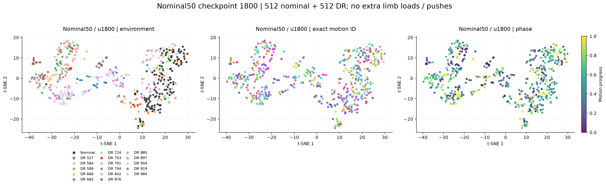

# Memory350 nominal50：update 1800 latent 分布核验

新版已经重新形成紧凑的 nominal 簇；与相同 update 的旧 all-DR 版相比，同一 DR 跨 motion 的漂移也减小。
但 DR 环境间距离同时缩小，当前 DR 区分程度尚未达到旧版后期或 v12。带四肢负载和推扰时，同环境跨 motion 距离仍高于匹配 motion/phase 的环境间距离。

同为 update 1800：nominal 跨 motion 距离降低 **87.7%**，同一 DR 跨 motion 距离降低 **47.3%**（common 场景）。

## 与前次一致的 common 场景

1024 个固定物理 world（512 nominal + 512 DR），42 motions，采集 3200 步、每 100 步查询；23559 个完整历史样本用于主表。
额外四肢负载和力脉冲关闭。这是复用之前 v12/Memory350 对照分布的诊断测试。

| 比较条件 | v12 u8000 | 旧 all-DR u22700 | 旧 all-DR u1800 | 新 nominal50 u1800 |
|---|---:|---:|---:|---:|
| nominal，不同 motion | 0.071 | 0.481 | 0.759 | 0.094 |
| 同一 DR，不同 motion | 0.234 | 0.447 | 0.764 | 0.403 |
| 不同 DR，同 motion、phase 差≤0.02 | 0.742 | 0.669 | 0.623 | 0.464 |
| 同一 DR，不同 motion，历史完全不重叠 | 0.234 | 0.448 | 0.761 | 0.407 |
| 同环境 / 环境间，越小越好 | 0.316 | 0.668 | 1.227 | 0.868 |

表中是每个 latent 先 L2 单位化，再计算配对欧氏距离的 RMS，与前次指标口径一致；数值来自真实 64 维空间。

[t-SNE 四模型对比图](common/plots/tsne_comparison.png) · [距离直方图](common/plots/distance_distributions.png) · [真实距离热图](common/plots/unit_distance_heatmaps.png) · [交互图](common/plots/tsne_interactive.html)

## 四肢负载及推扰场景

512 个固定 DR worlds，保留 tracker DR、随机推扰和四肢独立 U(0,4 kg) 负载；同一组 42 motions，13135 个完整历史样本。这组全部为 DR，用于检查训练中的 DR 部分。

| 比较条件 | v12 u8000 | 旧 all-DR u22700 | 旧 all-DR u1800 | 新 nominal50 u1800 |
|---|---:|---:|---:|---:|
| 同一 DR，不同 motion | 0.334 | 0.923 | 0.923 | 0.695 |
| 不同 DR，同 motion、phase 差≤0.02 | 0.700 | 1.060 | 0.788 | 0.651 |
| 同一 DR，不同 motion，历史完全不重叠 | 0.333 | 0.922 | 0.922 | 0.693 |
| 同环境 / 环境间，越小越好 | 0.478 | 0.871 | 1.171 | 1.066 |

[t-SNE 对比图](memory_training/plots/tsne_comparison.png) · [真实距离分布](memory_training/plots/distance_distributions.png) · [交互图](memory_training/plots/tsne_interactive.html)

## 原始尺度与跨 motion 环境识别

| 场景 / 模型 | raw latent 范数均值（DR） | 同 DR 跨 motion raw RMS | 环境间 raw RMS | 跨 motion 环境中心识别 Top-1 |
|---|---:|---:|---:|---:|
| common / v12 u8000 | 7.157 | 1.674 | 5.320 | 54.7% |
| common / 旧 all-DR u22700 | 7.237 | 3.232 | 4.843 | 22.6% |
| common / 旧 all-DR u1800 | 7.603 | 5.808 | 4.730 | 4.0% |
| common / 新 nominal50 u1800 | 7.666 | 3.090 | 3.560 | 3.5% |
| 负载/推扰 / v12 u8000 | 7.152 | 2.390 | 5.011 | 22.2% |
| 负载/推扰 / 旧 all-DR u22700 | 7.099 | 6.543 | 7.515 | 26.4% |
| 负载/推扰 / 旧 all-DR u1800 | 7.607 | 7.016 | 5.991 | 7.8% |
| 负载/推扰 / 新 nominal50 u1800 | 7.652 | 5.314 | 4.984 | 10.3% |

环境识别将 motion family 分为两组，用一组拟合每个环境的中心，在另一组识别 world ID；测试环境集合随场景变化，具体数量见 JSON。
推理时移除 long memory 会使新版负载场景的距离比从 1.066 增到 1.455。这支持长记忆在本测试中有帮助，但不等同于单独训练的 short50 对照。

## 协议与核验

- 冻结编号 checkpoint 1800；训练在测试期间继续。旧 all-DR 1800 控制训练轮次与架构，旧 22700 和 v12 8000 提供历史参照。
- 同一个 tracker 产生真实轨迹；三个 Memory350 checkpoint 共享同一 raw memory bank，分别使用自身的训练归一化。v12 同步读同一次交互。latent 不参与 tracker 控制。
- 每个主表查询都满足 Memory350 short50/long30×10 和 v12 short100 完整；另存含 reset/warmup 的分组。
- 两组实际物理字段与前次 probe 逐元素完全相同；物理会话未变化，memory 没有参数变化失效。
- 新 checkpoint 在线编码与保存的训练输入编码一致；复现的 DR 五步 NMSE 与日志相对误差约 6.3e-8。BF16/FP32 编码一致性另有记录。
- 同 DR 跨 motion 的历史不重叠分组仍保留上述趋势，不能将结果简单归因于共用 memory 片段。
- 同 motion/phase 是参考动作进度匹配，实际状态/动作序列并没有强制相同。42 motions 为控制性子集，不代表全部 129827 motions 或未见 motion 泛化。
- 两个 update 1800 都已做 7200 次 optimizer steps；nominal50 的 DR world 数减半，并重新采集归一化和训练轨迹。当前差异不能推断最终收敛效果。
- t-SNE 每模型独立拟合，标签不参与拟合；比较颜色混合，不比较图上的全局间距。随机预选 16 个 DR worlds，交互图点击两点可查看四个模型的真实距离。
- 聚类改善不能直接证明下游 policy 能利用；此处没有更新或评估 policy。

[数值核验](artifact_verification.json) · [物理核验](physics_verification.json) · [推理核验](inference_verification.json)

完整配对数量、按 query world bootstrap 的描述性区间、精确 motion frame 对照及其他历史分组见两个场景下的 `analysis/cluster_metrics.json`。
