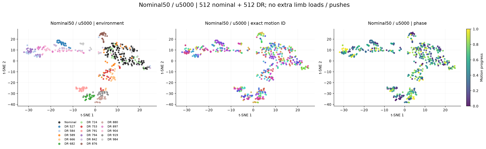
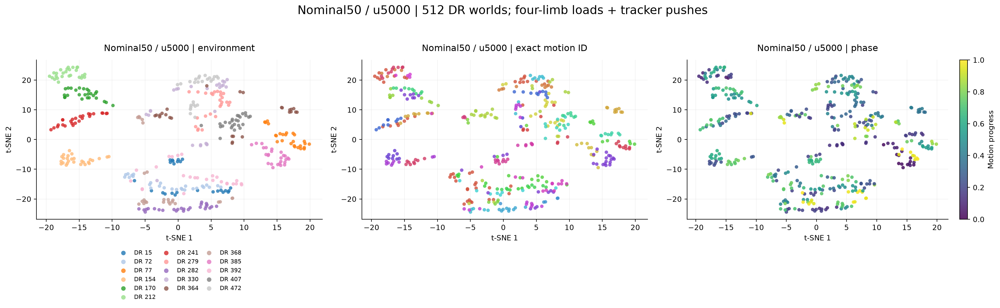

# Memory350 nominal50：update 5000 表征评估

**结论：nominal 簇已明显恢复，随训练推进，环境信息更容易跨 motion 读出；固定 DR 的跨 motion 单簇结构仍不够紧凑。**

共同基准的同环境 / 环境间距离比，从 u1800 的 0.855 改善到 u5000 的 0.625；负载/推扰组从 1.082 改善到 0.831。
不过，负载组同 DR 跨 motion 距离由 0.700 增到 0.774，当前进步主要来自环境间距离扩大；历史不重叠时同环境距离仍为 0.773。

**同轮次 all-DR 对照并非所有指标都落后。** 共同基准中，nominal50 的距离比更好（0.625 vs 0.761），但环境中心识别 Top-1 为 10.3%，低于 all-DR 的 14.1%；负载组则是 nominal50 22.0%，all-DR 19.8%。因此，可以确认 nominal 紧凑性和部分 DR 几何指标改善，尚不能说 DR 精细区分已经全面优于旧配置。

评估目标：同一组固定 DR 参数跨 motion、phase 的 latent 是否聚成紧凑的一团。
冻结 u5000，与本次相同轨迹上重新编码的 nominal50 u1800、旧 all-DR u5000、旧 all-DR u22700 和 v12 u8000 比较。

## 与前次一致的共同场景

1024 个固定物理 world：512 nominal + 512 DR；42 条 motion 的采样库，3200 控制步，每 100 步查询。主表采用 23,538 个共同完整历史样本，覆盖 41 条 motion。
无额外四肢负载、无随机力脉冲。

| 比较条件 | nominal50 u1800 | nominal50 u5000 | 旧 all-DR u5000 | 旧 all-DR u22700 | v12 u8000 |
|---|---:|---:|---:|---:|---:|
| nominal，不同 motion | 0.085 | 0.067 | 0.552 | 0.482 | 0.072 |
| 同一 DR，不同 motion | 0.405 | 0.393 | 0.532 | 0.453 | 0.242 |
| 不同 DR，同 motion、phase 差≤0.02 | 0.474 | 0.629 | 0.699 | 0.670 | 0.748 |
| 同一 DR，不同 motion，历史不重叠 | 0.408 | 0.396 | 0.535 | 0.455 | 0.242 |
| 不同 DR，同 motion、同一帧 | 0.413 | 0.585 | 0.619 | 0.608 | 0.731 |
| 同环境 / 环境间，越小越紧凑 | 0.855 | 0.625 | 0.761 | 0.676 | 0.324 |
| 跨 motion 环境中心识别 Top-1 | 3.5% | 10.3% | 14.1% | 22.2% | 52.0% |

距离来自真实 64 维 latent：逐个 L2 单位化后，计算配对欧氏距离的 RMS。

[t-SNE 对照](common/plots/tsne_comparison.png) · [真实距离热图](common/plots/unit_distance_heatmaps.png) · [距离分布](common/plots/distance_distributions.png) · [交互图](common/plots/tsne_interactive.html)

## 训练中的 DR 配置：四肢负载和推扰

512 个固定 DR world，保留 tracker DR、四肢独立 U(0,4 kg) 负载及随机力脉冲；42 motions，13,161 个共同完整历史样本。

| 比较条件 | nominal50 u1800 | nominal50 u5000 | 旧 all-DR u5000 | 旧 all-DR u22700 | v12 u8000 |
|---|---:|---:|---:|---:|---:|
| 同一 DR，不同 motion | 0.700 | 0.774 | 0.923 | 0.934 | 0.333 |
| 不同 DR，同 motion、phase 差≤0.02 | 0.647 | 0.932 | 0.997 | 1.056 | 0.697 |
| 同一 DR，不同 motion，历史不重叠 | 0.696 | 0.773 | 0.923 | 0.934 | 0.333 |
| 不同 DR，同 motion、同一帧 | 0.576 | 0.862 | 0.903 | 0.978 | 0.651 |
| 同环境 / 环境间，越小越紧凑 | 1.082 | 0.831 | 0.927 | 0.884 | 0.477 |
| 跨 motion 环境中心识别 Top-1 | 9.3% | 22.0% | 19.8% | 25.4% | 21.2% |

[t-SNE 对照](memory_training/plots/tsne_comparison.png) · [真实距离热图](memory_training/plots/unit_distance_heatmaps.png) · [交互图](memory_training/plots/tsne_interactive.html)

## 原始尺度与跨 motion 读出

| 场景 / 模型 | raw 范数均值（DR） | 同 DR 跨 motion raw RMS | 不同 DR 匹配 motion/phase raw RMS | 同环境样本更近比例 |
|---|---:|---:|---:|---:|
| common / nominal50 u1800 | 7.666 | 3.104 | 3.630 | 56.4% |
| common / nominal50 u5000 | 7.370 | 2.895 | 4.633 | 76.2% |
| common / 旧 all-DR u5000 | 7.244 | 3.851 | 5.061 | 73.1% |
| common / 旧 all-DR u22700 | 7.238 | 3.274 | 4.851 | 82.1% |
| common / v12 u8000 | 7.157 | 1.734 | 5.363 | 93.9% |
| memory_training / nominal50 u1800 | 7.652 | 5.354 | 4.949 | 49.1% |
| memory_training / nominal50 u5000 | 7.329 | 5.674 | 6.830 | 68.1% |
| memory_training / 旧 all-DR u5000 | 7.182 | 6.629 | 7.152 | 59.9% |
| memory_training / 旧 all-DR u22700 | 7.096 | 6.616 | 7.483 | 64.5% |
| memory_training / v12 u8000 | 7.152 | 2.378 | 4.992 | 88.0% |

“同环境样本更近比例”：针对同一查询，比对一个同 DR、不同 motion、历史不重叠的样本，以及一个不同 DR、同 motion、相近 phase 的样本。前者距离更小时计为成功。
环境中心识别将 motion family 分成两组，用一组估计每个 world 的中心，在另一组识别 world；候选环境数、Top-5 和 R² 见 JSON。这不是未见环境分类。

同一 u5000 模型在推理时屏蔽长期记忆，负载组环境中心识别率从 22.0% 降至 0.8%，距离比从 0.831 增至 1.228。这项消融支持长期记忆对当前模型的环境读出有帮助；它不是单独训练 short50 的对照。

## 固定验证集上的预测

| 指标 | nominal50 u1800 | nominal50 u5000 |
|---|---:|---:|
| DR 五步 NMSE | 0.05898 | 0.04120 |
| nominal 五步 NMSE | 0.02061 | 0.01134 |
| latent 距离与响应距离相关性 | 0.55488 | 0.65573 |
| 打乱 latent 后 DR 误差倍数 | 2.08420 | 3.27347 |

DR NMSE 降低 30.1%。打乱 latent 的误差变化说明 predictor 使用该输入，不能单独证明它只表示环境参数或对下游 policy 有益。
旧 all-DR 的训练验证集另行采集，因此没有把两个 run 的日志 NMSE 直接作为配对性能对照。

## 协议与核验

- 所有模型读取同一次 tracker 交互，Memory350 共享原始 memory bank，各自使用其 checkpoint 中的归一化；latent 不控制 tracker。
- 主表只保留 Memory350 short50 + long30×10、v12 short100 都完整的查询。memory_full 和 long_full 分组另外保存在 JSON。
- 物理参数与前次 u1800 probe 逐元素完全相同，且本次没有 physics-session invalidation；不要求 MuJoCo 轨迹与前次逐位相同。
- 同 motion/phase 指参考 motion 文件和进度；真实状态和动作历史没有被强制相同。
- 额外提供历史完全不重叠的同 DR 配对。主表数值已从保存的 64 维向量和配对索引独立重算。
- u5000 推理路径复现 DR NMSE=0.0412023673，与日志相对差异 -9.04e-08。
- BF16/FP32 编码一致性通过；原始 float32 query history 已缓存，可用于以后同轨迹 checkpoint 比较。
- 42 motions 是控制性子集，不能代表全部 129827 motions 或未见 motion 泛化。
- 同 update 对照控制优化轮次和网络大小；nominal50 的 DR world 数减半，归一化和采集轨迹也改变，不能把效果只归因于单一因素。
- 当前训练仍是 L_pred + 0.01 L_local + 0.02 L_relation，局部正样本为同 world/episode/motion 的 ±5 步；尚未加入跨 motion 聚类损失。
- t-SNE 每模型独立拟合，随机预选 16 个 DR world，标签只用于着色。图上全局间距不等于 64 维距离；交互图点击两点可查看真实距离。
- 本次评估期间两条 nominal50 训练继续；未修改训练权重、网络或 policy。

[推理核验](inference_verification.json) · [物理核验](physics_verification.json) · [数值核验](artifact_verification.json) · [原始历史重编码核验](cache_verification.json) · [交互距离核验](interactive_verification.json) · [完整指标](summary.json)
