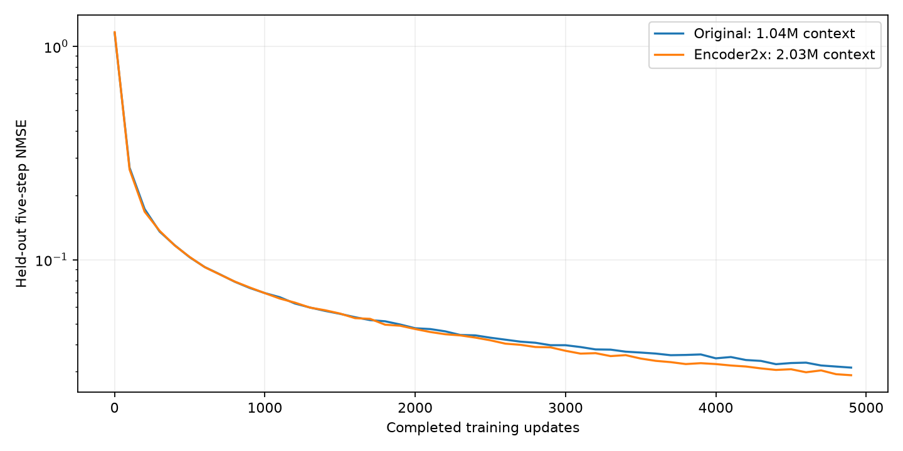

# Memory350 encoder 参数扩容：预测误差对照

原版 encoder 1,035,328 参数；扩容版 2,026,688（1.9575 倍）。
仅将三段 Transformer 深度由 1/2/2 改为 2/4/4；predictor 保持 19,059,798 参数，latent 保持 64 维。
两版从头训练，使用相同 predictor/公共层初始权重、训练配置、归一化和固定验证样本。

主要比较预先固定在 22700 updates；7500 及其他同轮 checkpoint 为阶段性结果。
按相同优化步数比较，扩容版计算量增加；这是一个训练种子的容量实验。

最新相同训练轮次：**4900**。训练日志口径（四 rank NMSE 平均）：
原版 **0.03118798** → 扩容版 **0.02872940**，误差变化 **-7.88%**。

负的误差变化表示扩容版更好。尚未到 22700 轮时，不据中期方向宣称最终收敛优势。

## 逐窗口配对评估

同一批 2048 个固定验证窗口；先合并窗口计算 NMSE，和训练日志的 rank 平均口径略有不同。
区间通过按物理 world 聚类的配对 bootstrap 计算，仅反映验证样本不确定性。

| Update | 原版五步 NMSE | 扩容版五步 NMSE | 误差降低 | 扩容/原版误差比 95% CI |
|---|---:|---:|---:|---|
| 100 | 0.27002355 | 0.26468635 | +1.98% | [0.9755, 0.9845] |
| 500 | 0.10260217 | 0.10290708 | -0.30% | [0.9902, 1.0161] |
| 1000 | 0.06972583 | 0.06968354 | +0.06% | [0.9840, 1.0166] |
| 3000 | 0.03970787 | 0.03735735 | +5.92% | [0.9040, 0.9741] |

最新配对 checkpoint：3000。分组如下：

| 分组 | 窗口数 | 原版 NMSE | 扩容版 NMSE | 误差降低 |
|---|---:|---:|---:|---:|
| all | 2048 | 0.03970787 | 0.03735735 | +5.92% |
| long_available | 1751 | 0.03610158 | 0.03504740 | +2.92% |
| short_incomplete_with_long | 931 | 0.03550521 | 0.03395114 | +4.38% |
| short_under10_with_long | 327 | 0.03557081 | 0.03351849 | +5.77% |
| short_full_with_long | 820 | 0.03711556 | 0.03691128 | +0.55% |
| no_long | 297 | 0.05824796 | 0.04923297 | +15.48% |
| full_30_chunks | 707 | 0.03360370 | 0.03282829 | +2.31% |

[扩容版训练 W&B](https://wandb.ai/2486344338-zhejiang-university/intact-forward-predictor/runs/m350scale-12b5f4c4b590)

原始逐窗口数据和分组区间见 comparison/update_*/paired_samples.npz、result.json。
