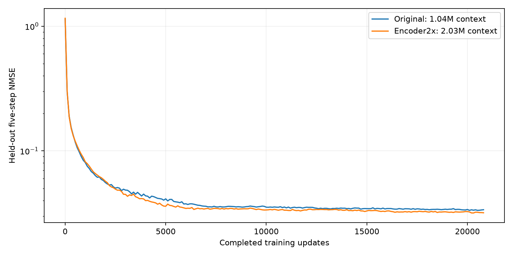

# Memory350 encoder 参数扩容：预测误差对照

原版 encoder 1,035,328 参数；扩容版 2,026,688（1.9575 倍）。
仅将三段 Transformer 深度由 1/2/2 改为 2/4/4；predictor 保持 19,059,798 参数，latent 保持 64 维。
两版从头训练，使用相同 predictor/公共层初始权重、训练配置、归一化和固定验证样本。

主要比较预先固定在 22700 updates；7500 及其他同轮 checkpoint 为阶段性结果。
按相同优化步数比较，扩容版计算量增加；这是一个训练种子的容量实验。

两版 A 环境均为 50% clean nominal + 50% tracker DR/四肢负载。
主表比较 DR 验证误差；nominal 单独列在分组结果中。原版 GPU 0–3，2x GPU 4–7。

最新相同训练轮次：**20800**。训练日志口径（四 rank NMSE 平均）：
原版 **0.03370229** → 扩容版 **0.03185814**，误差变化 **-5.47%**。

负的误差变化表示扩容版更好。尚未到 22700 轮时，不据中期方向宣称最终收敛优势。

## 逐窗口配对评估

同一批 2048 个固定验证窗口；先合并窗口计算 NMSE，和训练日志的 rank 平均口径略有不同。
区间通过按物理 world 聚类的配对 bootstrap 计算，仅反映验证样本不确定性。

| Update | 原版五步 NMSE | 扩容版五步 NMSE | 误差降低 | 扩容/原版误差比 95% CI |
|---|---:|---:|---:|---|
| 100 | 0.29684448 | 0.30143431 | -1.55% | [1.0097, 1.0222] |
| 500 | 0.11768857 | 0.11942539 | -1.48% | [0.9985, 1.0332] |
| 1000 | 0.08055434 | 0.08158004 | -1.27% | [0.9828, 1.0461] |
| 3000 | 0.04850200 | 0.04480333 | +7.63% | [0.8523, 1.0010] |
| 5000 | 0.04118260 | 0.03586603 | +12.91% | [0.7786, 0.9653] |
| 7500 | 0.03555308 | 0.03446283 | +3.07% | [0.8839, 1.0577] |
| 10000 | 0.03534863 | 0.03349094 | +5.26% | [0.8563, 1.0353] |
| 15000 | 0.03439456 | 0.03290720 | +4.32% | [0.8691, 1.0460] |
| 20000 | 0.03387464 | 0.03248816 | +4.09% | [0.8631, 1.0561] |

最新配对 checkpoint：20000。分组如下：

| 分组 | 窗口数 | 原版 NMSE | 扩容版 NMSE | 误差降低 |
|---|---:|---:|---:|---:|
| all | 2048 | 0.02300407 | 0.02197305 | +4.48% |
| long_available | 1744 | 0.01392261 | 0.01383080 | +0.66% |
| short_incomplete_with_long | 899 | 0.01550117 | 0.01495502 | +3.52% |
| short_under10_with_long | 300 | 0.01397420 | 0.01343052 | +3.89% |
| short_full_with_long | 845 | 0.01138085 | 0.01202060 | -5.62% |
| no_long | 304 | 0.06609634 | 0.06060873 | +8.30% |
| full_30_chunks | 690 | 0.01632359 | 0.01613441 | +1.16% |
| nominal | 1018 | 0.00868464 | 0.00812187 | +6.48% |
| dr | 1030 | 0.03387464 | 0.03248816 | +4.09% |
| dr_full_30_chunks | 383 | 0.02081712 | 0.02044327 | +1.80% |
| nominal_full_30_chunks | 307 | 0.00797695 | 0.00813077 | -1.93% |

[扩容版训练 W&B](https://wandb.ai/2486344338-zhejiang-university/intact-forward-predictor/runs/m350scale-n50-022050a4d5bb)

原始逐窗口数据和分组区间见 comparison/update_*/paired_samples.npz、result.json。
