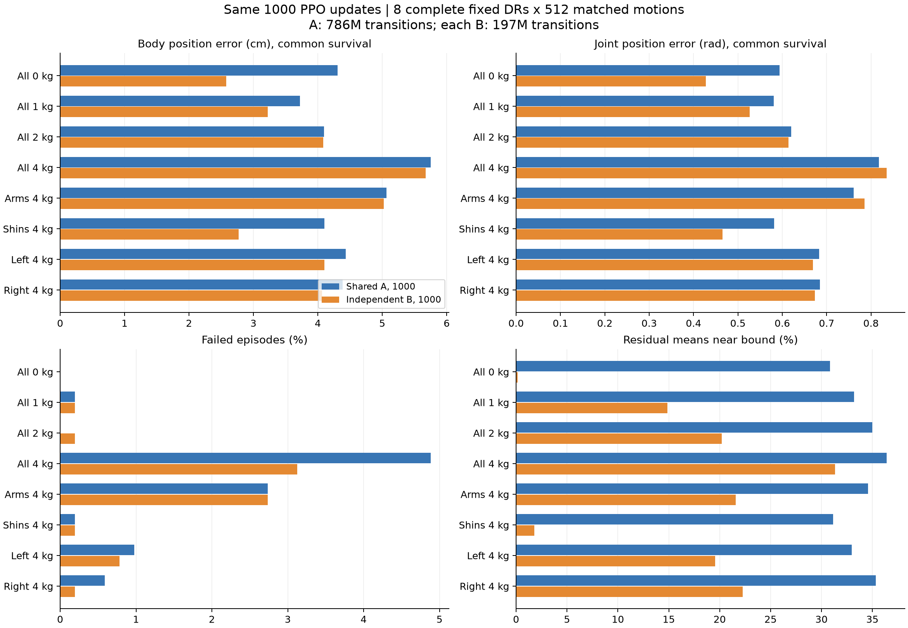

# 1000 轮：八个固定 DR 独立 policy 与共享 policy

A 和八个 B 均使用完成 1000 个 PPO update 的 checkpoint。共享 A 的本次结果重新评测；不是原自动监控的 A4000。
每组 DR 512 条相同 motion、相同起始状态、相同完整物理参数和种子，horizon 至多 1000 步（motion 结束可提前完成）。
完整 DR、motion、起始 qpos/qvel、奖励配置、FP32 精度及 checkpoint 配对检查全部通过。

## 主要跟踪结果

body/joint 均在两者共同存活时间内计算，先逐 motion 取均值，再对 512 条 motion 等权平均。下降百分比为 (A−B)/A。

| DR | Body A / B (cm) | Body 下降（95% CI） | Joint A / B (rad) | Joint 下降 | 失败率 A / B |
|---|---:|---:|---:|---:|---:|
| 零负载 | 4.308 / 2.576 | 40.20% [38.45, 41.84] | 0.5936 / 0.4279 | 27.92% | 0.00% / 0.00% |
| 四肢各 1 kg | 3.722 / 3.223 | 13.40% [12.14, 14.61] | 0.5805 / 0.5268 | 9.24% | 0.20% / 0.20% |
| 四肢各 2 kg | 4.095 / 4.081 | 0.33% [-0.69, 1.31] | 0.6202 / 0.6142 | 0.97% | 0.00% / 0.20% |
| 四肢各 4 kg | 5.751 / 5.676 | 1.29% [0.04, 2.50] | 0.8176 / 0.8350 | -2.14% | 4.88% / 3.12% |
| 双臂各 4 kg | 5.067 / 5.024 | 0.85% [-0.14, 1.85] | 0.7609 / 0.7854 | -3.22% | 2.73% / 2.73% |
| 双小腿各 4 kg | 4.105 / 2.772 | 32.47% [30.79, 34.06] | 0.5818 / 0.4657 | 19.96% | 0.20% / 0.20% |
| 左侧手/小腿各 4 kg | 4.435 / 4.099 | 7.58% [6.44, 8.68] | 0.6832 / 0.6690 | 2.07% | 0.98% / 0.78% |
| 右侧手/小腿各 4 kg | 4.383 / 4.068 | 7.20% [5.96, 8.36] | 0.6850 / 0.6738 | 1.65% | 0.59% / 0.20% |

## 八组等权汇总

| 指标 | 共享 A | 独立 B | 下降百分比 |
|---|---:|---:|---:|
| 共同存活 body (cm) | 4.4833 | 3.9400 | 12.12% |
| 共同存活 joint (rad) | 0.6653 | 0.6247 | 6.11% |
| Root/anchor position (cm，按各自 episode 截断) | 27.3043 | 23.1643 | 15.16% |
| Root/anchor rotation (rad，按各自 episode 截断) | 0.0746 | 0.0677 | 9.32% |
| 失败率 (%) | 1.1963 | 0.9277 | 22.45% |
| 覆盖率 (%) | 99.2560 | 99.4202 | -0.17% |
| 平均 episode return | 93.0153 | 94.3376 | -1.42% |

覆盖率和 return 越高越好，其‘下降百分比’为负时表示改善。汇总 CI 见 summary.json：以 motion 为单元对全部 8 个 DR 联合重采样，避免重复计算同一 motion 的独立性。

## Root、回报和残差

Root 指日志的 error_anchor_pos / error_anchor_rot。此表按各自 episode 截断，须结合失败率和覆盖率解释。

| DR | Root pos A / B (cm) | Root rot A / B (rad) | Coverage A / B (%) | Return A / B | Residual 接近上限 A / B (%) |
|---|---:|---:|---:|---:|---:|
| 零负载 | 20.06 / 11.92 | 0.0854 / 0.0509 | 100.00 / 100.00 | 97.25 / 102.15 | 30.82 / 0.16 |
| 四肢各 1 kg | 17.78 / 16.39 | 0.0687 / 0.0607 | 99.87 / 99.84 | 97.05 / 97.98 | 33.21 / 14.85 |
| 四肢各 2 kg | 24.97 / 23.75 | 0.0651 / 0.0683 | 100.00 / 99.88 | 94.43 / 93.93 | 35.01 / 20.21 |
| 四肢各 4 kg | 46.73 / 35.35 | 0.0808 / 0.0871 | 96.92 / 98.02 | 84.11 / 85.57 | 36.39 / 31.32 |
| 双臂各 4 kg | 32.85 / 31.90 | 0.0727 / 0.0787 | 98.24 / 98.28 | 87.99 / 87.42 | 34.58 / 21.59 |
| 双小腿各 4 kg | 23.02 / 18.82 | 0.0795 / 0.0563 | 99.89 / 99.88 | 97.29 / 100.26 | 31.15 / 1.78 |
| 左侧手/小腿各 4 kg | 26.88 / 23.69 | 0.0721 / 0.0679 | 99.45 / 99.61 | 92.69 / 93.75 | 32.97 / 19.57 |
| 右侧手/小腿各 4 kg | 26.15 / 23.50 | 0.0727 / 0.0714 | 99.69 / 99.86 | 93.32 / 93.65 | 35.32 / 22.25 |

Residual 均值为 0.25*tanh(head)，接近上限定义为绝对值 ≥0.2375，统计关节维度比例并对 episode/motion 等权平均。训练的 Gaussian 探索噪声不受这个均值范围限制。

## 比较边界

共享 A：786,432,000 transitions；每个 B：196,608,000；八个 B 合计：1,572,864,000。相同轮数并不代表相同总样本预算。
A 在连续随机 DR 上训练，B 在各自固定完整 DR 上训练。这是在检验专门训练的收益，不是只改变参数共享方式的严格消融。
仅一个训练 seed；区间衡量这 512 条 motion 的差异，不代表多训练 seed 的稳定性。每个负载组合还带有自己的其他静态 DR，零负载并非 nominal。

原始逐 motion 结果、checkpoint/协议哈希和全部配对指标见 summary.json；数值表见 summary.csv。
