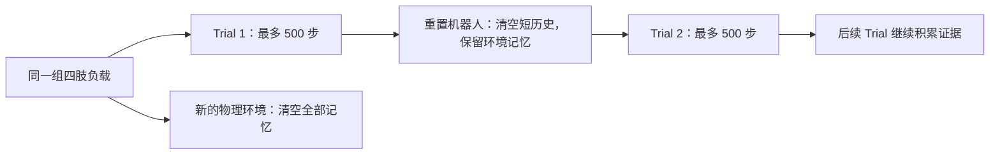

# 参考 LocoFormer 扩展环境 context

2026-09-09。建议保留正在训练的 200-step 实验作为对照，下一步先分离“轨迹终止”和
“环境记忆清空”，再把 encoder 改成可缓存的因果模型。以下是调研和待验证方案，
没有把这些新设计应用到正在运行的训练中。

## 论文中可借鉴的设计

LocoFormer 将一次重置前的轨迹称为 trial；同一任务的多个 trial 构成一个 episode。
记忆跨 trial 保留，在 episode 边界用 mask 隔断。模型采用 Transformer-XL：按 segment
处理序列，缓存各层历史 hidden state，并对缓存停止梯度；推理时增量更新 KV。
论文举例为 6 层、segment 128，最大感受范围 896 控制步，50 Hz 下约 18 秒；直接 KV
范围是最多 `2L−1`。其 actor/critic 从共享主干读出，PPO 的目标覆盖多个 trial。
[LocoFormer §2.1–2.2](https://arxiv.org/html/2509.23745v1#S2)。

这些定义解释了“跨 episode 适应”与正文“attention 不跨 episode”的表面矛盾：普通控制
代码里的一次 episode reset，更接近论文的 trial reset。项目页也明确描述了 trial 间保留
记忆及更大 episode 内的回报目标。[作者项目页](https://generalist-locomotion.github.io/)。

论文展示的“更多适应时间带来更好表现”，不能直接证明在我们的固定 G1 / 四肢负载任务中，
只增大窗口就会持续提高 PPO 性能。我们需要分别验证可用历史、缓存容量和策略收益。
作者项目页没有列出官方训练代码；搜索到的 `lucidrains/locoformer` 是第三方实现，
不能把它的超参数视为原实验设置。缓存机制可以参考
[Transformer-XL 作者实现](https://github.com/kimiyoung/transformer-xl/blob/master/pytorch/mem_transformer.py)，
其中 `init_mems`、`_update_mems` 和 `_forward` 分别负责记忆初始化、截断/停止梯度与因果 attention。

## 我们当前最先遇到的限制

本仓库实际 episode 为 500 步。`LimbContextWrapper.step` 在 done 或 motion resample 时
清空全部 context；replay 用同一 episode 和连续 episode_step 构造历史。这个限制来自
当前实现，不是系统辨识必须遵守的边界。

200-step 阶段一在 update 6100 的普通训练 batch 中，完整历史比例为 **7.13%**；最近
10 次记录平均 **7.53%**，固定普通验证 batch 为 **3.91%**。这些是日志中的 rank-0 batch
比例，不代表全数据集精确比例。表征诊断另用完整正样本 batch，不能把诊断正常理解为
普通训练 batch 中也有充足的完整历史。直接扩到 400/500 会进一步限制这类样本。

我们也在已完成的 seed 122 / FiLM 轨迹上做了纯历史长度统计：

| 固定每处负载 | 可用完整 100 步的决策比例 | 200 步 | 400 步 | 500 步 |
|---|---:|---:|---:|---:|
| 0 kg | 67.41% | 38.62% | 7.14% | 0% |
| 2 kg | 67.29% | 38.52% | 7.12% | 0% |
| 4 kg | 65.77% | 37.20% | 6.85% | 0% |

这里使用原 100-step policy 的固定轨迹，计算 `sum(max(episode_length−H,0))/sum(episode_length)`；
它衡量历史可得性，不是新 encoder 的性能预测。统计及缓存估算保存于
`.runtime/research/locoformer/local_observations.json`。

另一个限制是当前 `DynamicsContextEncoder` 对整个已完成历史使用双向 attention + CLS，
而且位置编码随滑动窗口位置变化。它在决策时没有看未来，但历史 token 的 hidden state
会随新历史重新计算，**不能直接复用旧 KV 并宣称结果等价**。Transformer-XL 的相对位置
方案就是为跨段复用状态而设计的。[Transformer-XL §3](https://aclanthology.org/P19-1285.pdf)。

## 推荐的边界规则

保留 500-step 轨迹、原 reward、GAE、负载分布和其他物理设置。增加内部
`physics_session_id` 管理允许共享环境记忆的范围；这个 ID 仅用于索引和 mask，不能输入
encoder、actor 或 critic。

| 发生的事件 | Predictor 最近 10 步 | 环境 context |
|---|---|---|
| 跌倒、500 步 timeout、motion 切换，同一 world 的负载未变 | 清空并 mask | 保留合法历史，标注边界 |
| 切换 world、负载重新采样、重新构造模拟器 | 清空 | 清空 |
| 为训练冷启动而主动清除记忆 | 不改变真实物理轨迹 | 清空 |

当前负载在每个 world 启动时独立采样，此后固定，适合第一条。即使允许跨 trial，仍然
需要定期采样空记忆起点，避免只训练“已经辨识完环境”的成熟记忆；清记忆不需要重采负载。
突变负载的在线检测/遗忘可另测，第一轮先遵守现有固定负载设置。

**保留记忆不等于拼接虚假的动力学跃迁。** 每个合法交互必须显式保存
`(s_t, applied_target_t, s_{t+1})`。自动 reset 返回的新状态不能作为上一动作的物理结果。
现有实现从相邻 history_state 推导 next_state；跨 trial 后必须改成显式 outcome，
reset 边界使用单独标记，保守地丢弃无法获得真实 terminal state 的边界交互。
5 步预测目标仍不得跨 reset/motion teleport，不能用 mask 简单放开全部 episode 限制。

## 三条扩展路径

| 路径 | 做法 | 优点 | 主要代价/限制 |
|---|---|---|---|
| 跨 trial 的固定窗口 | 显式交互 + 边界，先固定 200 步保留历史，再试 512 步 | 最直接检验“失败后丢记忆”是否是瓶颈 | 每步仍重算 attention，长窗口成本高 |
| **Transformer-XL context encoder** | 因果 token、分段训练、各层记忆和增量 KV | 长期扩展的首选；冻结后适合大规模 PPO rollout | 需要处理序列 replay、位置编码和缓存一致性 |
| 分层压缩记忆 | 最近 200 步细节 + 更早历史的少量摘要 token | 固定计算量覆盖更久的交互 | 压缩可能丢失负载辨识所需的细节，需单独验证 |

第三条借鉴 Compressive Transformer 对旧 hidden state 压缩后继续保留的思路，
不代表已有机器人负载任务上的验证结果。
[Compressive Transformer §3](https://arxiv.org/html/1911.05507v1#S3)。
例如保留最近 200 个交互，每 50 个旧交互压成 4 个 token，16 个旧块覆盖额外 800 步，
聚合器共读取 264 个 token。旧块不能把 reset 当作物理转移；有学习参数的压缩器还必须
有梯度路径，可通过短段展开或单独的重建目标训练，不能全程 detach 后期待它自动学会压缩。

我建议先固定 200 步完成跨 trial 的边界对照，再做 TXL；只有在较长 TXL cache 的显存/
吞吐确实成为限制时，再引入压缩。GRU 等固定大小记忆可以作为低成本对照；LocoFormer
的大规模跨形态任务中 GRU 较差，也不能直接排除它对本任务四个固定负载参数的适用性。

## TXL 接入两阶段 pipeline 的具体方案

第一版保留 encoder 的 **2 层、宽 128、4 heads、输出 z=64**；predictor 仍用最近 10 步、
5 步预测及原 nominal counterfactual 监督。训练 segment 可先取 **L=128**，每层保留
**M=128 / 256 / 512** 个历史状态。128 不是必须值，可以在短测中与 100 比吞吐；所有
预测 query 仍按真实时间索引与原 5 步目标对齐，不能简单把每个 segment 当作一个 PPO update。

每个 token 对应一个已经完成的合法交互。在 segment 内使用因果 mask，缓存较早 segment
的各层 hidden state 并停止梯度，使用相对位置表示。z 从当前可用的最后一个因果状态或
独立 readout query 产生；readout query 不回写历史，不能把整段最后才知道的信息用于段内
更早时刻。空记忆和边界标记都需要训练。

训练 attention 的每段主要项为 `O(N·L·(M+L)·d)`；推理每步 attention 为
`O(N·(M+L)·d)`，另有 token 投影和 FFN 的开销。这些是理论规模，不是 GPU 加速比。
固定容量能持续处理任意长的流，但不代表完整记住无限历史；多层状态携带更早的信息，
实际有效记忆要用干预和性能曲线测量，不能把 KV 数直接等同于原始历史步数。

按阶段二每卡 8192 env、2 层、宽 128、BF16 估算，仅 K/V 缓存为
`2 × N × envs × slots × d × 2 bytes`：

| 每层过去记忆 M | 过去部分 K/V | 加上最多一个当前 segment 的 K/V，近似上界 |
|---|---:|---:|
| 128 | 1 GiB | 2 GiB |
| 256 | 2 GiB | 3 GiB |
| 512 | 4 GiB | 5 GiB |

不含模拟器、actor/critic、梯度、临时 activation，也不包含同时额外保存整份 hidden-state
archive 的开销。正式选型需要在 8192 env 下测峰值显存、PPO updates/hour 和推理 p95 延迟。
先增加 M、固定层数，避免把增加模型容量误当成 context 收益。

阶段一 replay 必须保留同一 world/session 的原始连续序列。采样 query 时先用当前模型
无梯度重放前缀以重建记忆，再对目标 segment 计算梯度，保留原来每卡有效 query 数和
motion-balanced 目标采样。前缀只提供上下文，不额外计入监督 query 数。前缀长度必须
足以覆盖依赖范围，或从 session 开始重放；不能把旧参数生成的 hidden state 当作当前
精确记忆。这是 recurrent replay 的已知问题，burn-in 是一种缓解机制，并非自动保证等价。
[R2D2 §3](https://openreview.net/references/pdf?id=H1SpI6cKm)。

正样本的 query 仍限定同一 trial/motion、相隔 5 步，避免同时更改正样本语义；但各自的
环境历史可以来自同一 physics session 的更早 trial。完整历史资格、预测窗口资格要
分别判断，不能继续要求全部 context 都属于 query 当前 episode。
验证 world、记忆和序列与训练分离；不要让训练世界的缓存进入 held-out probe。

阶段二冻结 encoder 后，只需每个 world 持有缓存，并把当时的 z 写入 PPO rollout buffer。
actor/critic 的 FiLM、初始化和优化保持一致；PPO minibatch 可以继续训练这些已记录的 z，
**不需要为此把 actor/critic 改成 recurrent PPO，也不需要跨 trial 修改 GAE**。
这验证的是“跨轨迹环境辨识帮助策略”，不等价于复现 LocoFormer 的跨 trial 探索回报目标。

## 如何确认 scaling 有效

先保留当前 100/200、每次 reset 清记忆的对照。新实验采用如下顺序：

1. 同一个 200-step 模型规格，对比 reset 清空 / 同负载保留历史，检验边界规则。
2. TXL 固定 2×128，只改变 M=128/256/512；除常规重训对照外，用同一 checkpoint 做
   历史长度干预，区分训练容量和测试时信息量。
3. 对同一条原始轨迹分别从空缓存重编码最近 100/200/500/1000 步。**不能只裁切现有 KV**：
   较近 token 的高层 hidden state 可能已携带更旧信息，会污染“只看最近 H 步”的对照。
4. 阶段一按相同 world/query 比较 DR NMSE、latent 对响应的相关性、打乱/错误世界记忆
   后的预测退化、不同记忆年龄下的表现，并统计有效样本数量。图按 optimizer steps 和
   GPU-hours 分别画，不能只看 iteration 标签。
5. 阶段二继续至少 5000 PPO updates，保留配对 seeds 和原 0/2/4 kg 测试。
   单独报告空记忆起步和带 0/100/200/500/1000 步适应经历的起步；后者可以含失败 trial，
   必须计入适应耗时和失败次数，不与旧冷启动成绩混为一个指标。

更长 context 在新运行中仍只包含真实的过去交互，不输入质量标签、world ID 或 nominal
反事实结果。nominal rollout 继续只用作阶段一监督。长历史不应靠泄露物理参数获得收益。

优先实现涉及的本地文件：`data/predictor_online.py`（双重边界与序列采样）、
`forward_predictor.py`（因果交互和缓存）、`forward_predictor_objective.py`（query 对齐）、
`residual_context.py` / `limb_context_env.py`（每 world 记忆生命周期），以及匹配的 checkpoint
导出和 cold/warm 评估协议。必须先验证完整前向与增量缓存等价、异步 reset 不串 world、
无未来信息、无虚假 reset 转移，以及 resume 后缓存重建。
