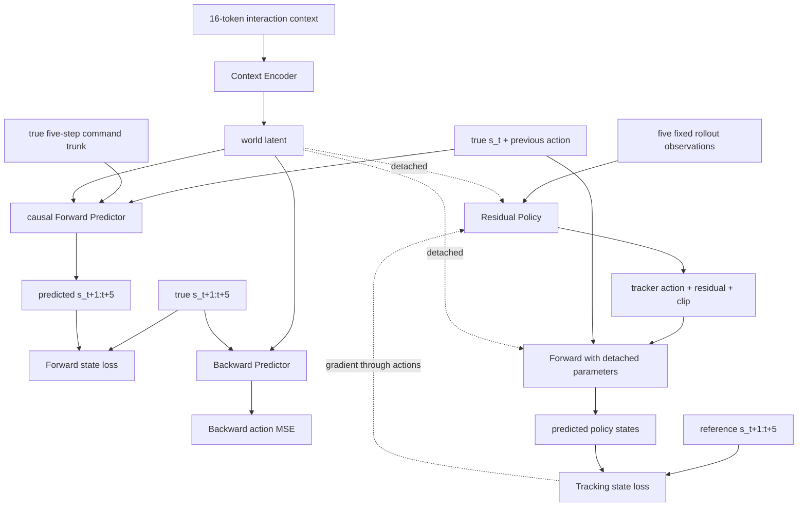

# Context-conditioned residual policy 训练流程

该入口在冻结 SPV5-2 tracker 上叠加一个有界 residual policy，并通过 learned Forward
Predictor 的五步状态预测梯度优化 residual。它与原有 Stage-I INTACT 入口并存，不复用旧
Intent-to-Action actor 的 checkpoint 格式。

## Rollout 与样本

每个控制步执行：

```text
a_tracker,t = FrozenTracker(o_deploy,t)
delta_a_t   = ResidualPolicy(w_t, o_deploy,t)
a_t         = clip(a_tracker,t + delta_a_t)
```

其中 `o_deploy,t` 采用冻结 tracker 的归一化 policy feature，而不是只包含关节状态的 64 维
JEPA observation。Residual 初始输出层为零，所以训练开始时系统严格复现 frozen tracker。

每个 residual query 是连续五步：

```text
policy observations: o_t ... o_t+4
commands:            a_t ... a_t+4
physical states:     s_t ... s_t+5
reference states:          r_t+1 ... r_t+5
```

物理状态为 71 维：root position/quaternion、root linear/angular velocity、29 维 joint
position 和 29 维 joint velocity。`a_t-1` 作为独立历史条件输入，不写入 `s_t+1`，因此
Backward Predictor 无法从 next-state 直接读取 action label。

Context 沿用仓库既有契约。每个 token 为：

```text
kappa_i = [proprio_before, a_i ... a_i+4, proprio_after]
proprio  = [joint_pos, joint_vel, projected_gravity, base_ang_vel,
            previous_action, joint_torque]
```

每个 token 389 维，固定使用当前 query 之前同一个 physics world 的 16 个 token。Context
可以跨 episode，但 query 不跨 reset boundary。Residual rollout 后 token 中记录的是最终
下发总动作，不是 frozen tracker 的基础动作。

## 网络与梯度路由



一次联合反向传播中的参数更新严格为：

| Loss | Context Encoder | Forward | Backward | Residual Policy |
|---|---:|---:|---:|---:|
| Forward | 更新 | 更新 | 不更新 | 不更新 |
| Backward | 更新 | 不更新 | 更新 | 不更新 |
| Tracking | 不更新 | 不更新参数、保留 action Jacobian | 不更新 | 更新 |

Forward 使用 GRU 顺序处理五个 action，因此第 `k` 个预测只依赖前 `k` 个 action，不存在
future-action leakage。Tracking 分支通过无参数梯度的 functional Forward 调用实现：Forward
参数被 detach，但 action 输入保留梯度。

## Tracking error 与 W&B

Rollout 按 SPTracking 的命名记录以下瞬时误差：

- `error_anchor_pos`、`error_anchor_rot`；
- `error_anchor_lin_vel`、`error_anchor_ang_vel`；
- `error_body_pos`、`error_body_rot`；
- `error_joint_pos`、`error_joint_vel`。

Warmup 全程 residual 为零，其聚合均值被保存为 frozen-tracker baseline。之后每轮同时记录
当前误差、`ratio_to_tracker` 和 `relative_improvement`；后者大于零表示优于 warmup tracker。
Reset boundary 不进入统计。

W&B 默认开启，只在 rank 0 上传：

- `train/*`：总损失、Forward/Backward/Tracking 分量、各状态分组误差、context shuffle ratio；
- `tracking/*`：真实 rollout error、tracker baseline、ratio 和 improvement；
- `optimization/*`：总/model/policy gradient norm 和两组 learning rate；
- `replay/*`：容量、样本数、每轮新增样本和显存字节数；
- residual action 的 mean/RMS/max、clipped fraction 和相对 tracker 的动作改变量。

## 启动

```bash
./scripts/run_residual_training.sh \
  /path/to/tracker.pt \
  /path/to/motions \
  /path/to/runs/residual \
  --num-envs 4096 \
  --batch-size 512 \
  --updates 100000 \
  --wandb-project intact-residual-tracking \
  --wandb-name residual-v1
```

多卡继续使用 `GPUS=0,1,...`。无网络环境可传 `--wandb-mode offline`；完全关闭使用
`--no-wandb`。本地始终保留 `metrics.jsonl`、`history.json`、`normalization.json`、
`run_config.json` 和 checkpoint。

