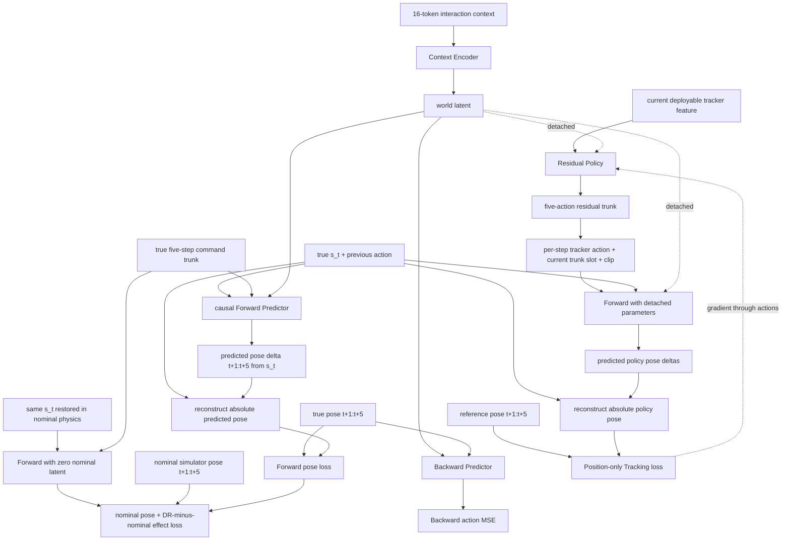

# Context-conditioned residual policy 训练流程

该入口在冻结 SPV5-2 tracker 上叠加一个有界 residual policy，并通过 learned Forward
Predictor 的五步 pose-delta 预测梯度优化 residual。它与原有 Stage-I INTACT 入口并存，不复用旧
Intent-to-Action actor 的 checkpoint 格式。

## Rollout 与样本

每条 trunk 开始时只执行一次 Residual Policy：

```text
delta_A_t:t+4 = ResidualPolicy(w_t, o_deploy,t)  # [5, 29]
```

之后五个真实仿真控制步逐槽执行：

```text
a_tracker,t+k = FrozenTracker(o_deploy,t+k)      # 每步重算
a_t+k         = clip(a_tracker,t+k + delta_A[k])
```

其中 `o_deploy,t` 采用冻结 tracker 的归一化 policy feature，而不是只包含关节状态的 64 维
JEPA observation。Residual 初始输出层为零，所以训练开始时系统严格复现 frozen tracker。

所以它是“open-loop residual trunk + closed-loop frozen tracker”，不是五次独立 residual
policy 调用。每个 residual query 是连续五步：

```text
policy observation:  o_t
residual trunk:       delta_a_t ... delta_a_t+4
tracker actions:      a_tracker,t ... a_tracker,t+4
commands:            a_t ... a_t+4
physical states:     s_t ... s_t+5
reference states:          r_t+1 ... r_t+5
```

物理状态为 71 维：root position/quaternion、root linear/angular velocity、29 维 joint
position 和 29 维 joint velocity。`a_t-1` 作为独立历史条件输入，不写入 `s_t+1`，因此
Backward Predictor 无法从 next-state 直接读取 action label。

Forward 保留完整 71 维 `s_t` 作为输入，但输出只有 35 维 pose delta：3 维 root translation、
3 维 root rotation vector 和 29 维 joint displacement。每个 `delta_q_t+k` 都直接相对同一个
`s_t`，而不是相对上一个预测递归累加。平移和关节改变量使用对应 state standard deviation
归一化；旋转向量使用弧度，并以左乘相对旋转重建 scalar-first `(w,x,y,z)` quaternion。
未来 velocity 不属于 Forward 输出，也不进入 Forward/Tracking loss。

Context 沿用仓库既有契约。每个 token 为：

```text
kappa_i = [proprio_before, a_i ... a_i+4, proprio_after]
proprio  = [joint_pos, joint_vel, projected_gravity, base_ang_vel,
            previous_action, joint_torque]
```

每个 token 389 维，固定使用当前 query 之前同一个 physics world 的 16 个 token。Context
可以跨 episode，但 query 不跨 reset boundary。Residual rollout 后 token 中记录的是最终
下发总动作，不是 frozen tracker 的基础动作。

Reset 不会清空 Context。跨越仿真 teleport 的 boundary transition 被排除，同时只废弃对应
vector slot 尚未执行的 trunk suffix；reset 完成后的状态立即生成一条新 trunk，并可作为下一条
五步 query 的 `s_t`。Replay 额外核对 query 的 trunk slot 必须严格为 `0,1,2,3,4`，因此 optimizer
更新导致的全局 replan、异步 reset 或其他 trunk 边界都不可能混入同一训练样本。各 vector slot 的初始
episode timeout phase 默认独立随机化，使 post-reset 数据持续分散进入 replay，而不是每隔固定
周期形成同步数据突变。需要复现实验性同步 timeout 时可传
`--no-randomize-initial-episode-phase`。

## 网络与梯度路由



模型与 policy 交替反向传播，参数更新严格为：

| Loss | Context Encoder | Forward | Backward | Residual Policy |
|---|---:|---:|---:|---:|
| Forward | 更新 | 更新 | 不更新 | 不更新 |
| Backward | 更新 | 不更新 | 更新 | 不更新 |
| Nominal pair | 更新 | 更新 | 不更新 | 不更新 |
| Tracking | 不更新 | 不更新参数、保留 action Jacobian | 不更新 | 更新 |

Forward 与 Tracking 共用三个 pose component，默认权重调整为 root position `5.0`、root
orientation `2.0`、joint position `1.0`，使 Predictor 精度和 Policy 梯度都优先保护 root。
root linear/angular velocity 和 joint velocity 仍作为真实 rollout 指标上传，但不参与这两个
loss。训练启动时会打印一条
`event=loss_weights` JSON；之后每条训练 record 也包含同一份 `loss_weights`，同时
`run_config.json` 持久化该配置。总目标中的 Forward 和 Backward 权重均为 `2.0`，Tracking
权重为 `1.0`。Residual L2 权重由 `0.001` 提高为 `0.2`；smooth 权重保持 `0.001`。

Forward 使用 GRU 顺序处理五个 action，因此第 `k` 个预测只依赖前 `k` 个 action，不存在
future-action leakage。Tracking 分支通过无参数梯度的 functional Forward 调用实现：Forward
参数被 detach，但 action 输入保留梯度。Tracking loss 在 `s_t` 与预测 delta 重建出的绝对
pose 上计算；如果只比较 reference delta，当前已经存在的位置偏差将无法被 residual 纠正。
`forward_nmse` 使用零 pose delta（保持当前 pose 不动）的 loss 作为分母，因此小于 `1.0`
表示优于 no-change baseline。

### Nominal 反事实配对

每个 model mini-batch 默认都建立等量配对样本。训练器把 DR replay 的 `s_t`、`a_t-1` 和五步
实际总动作恢复到一个独立的无 DR simulator，并开环重放相同动作，得到 nominal target。该
simulator 只保留 checkpoint 的 scene、actuator 和控制周期；所有 DR event 与 task manager
均在构造前移除。

恢复顺序是清空 simulator/entity/action buffer、写入 root 与 joint 的 qpos/qvel、恢复 previous
action/history、写入仿真并调用零时间 `sim.forward()`。不执行 physics warmup，因为 warmup 会
改变配对起点。首次使用会自动重复完整的 restore + 五步 rollout，检查即时状态误差和轨迹
可重复性；不满足 `--nominal-restore-atol` 会直接终止训练。nominal 构造时还会固定 action term
内部的 delay、smoothing alpha、torque-limit scale 与 boot delay，避免 action reset 自身重新
采样。重复性 pose 指标只包含 root position/quaternion 与 joint position，不包含 velocity。
失败时，每个 rank 会在输出目录写入 `nominal_repeat_failures_rank_<rank>.jsonl`，记录 p50/p95/
p99/max、最坏 horizon/state component，以及对应的 motion path、motion id 和 motion step。

Forward 同时拟合 `F(z_dr,s,A)` 的 DR target 与 `F(0,s,A)` 的 nominal target，并显式拟合两者
的 pose effect 差。这样 state/action 完全相同而 target 随物理参数变化，忽略 context 的模型
无法把 pair loss 降低。重点指标是 `nominal_effect_nmse`（低于 1 才优于预测“无 DR 效应”）和
`nominal_context_swap_ratio`（高于 1 表示正确 context-target 配对优于交换配对）。

每轮先用普通 replay 更新 Context Encoder、Forward 和 Backward，再从最近一个 policy 版本产生的
完整 trunk 样本更新一次 Residual Policy。Policy optimizer 完成后，所有尚未执行完的旧 trunk
都会失效；Replay 的 slot 序列检查会丢弃这些不完整片段。训练同时记录
`candidate_action_recompute_abs_mean/max`：它比较当前 policy 重算出的五步动作与 rollout 中实际
执行动作；该值显著偏离零意味着样本不再满足预期的 on-policy trunk 契约。

### Residual policy 中的 reference 覆盖

当前 SPV5-2 `get_latent()` 的 1645 维 deploy-time feature 内，`reference.standard` 使用的
reference offsets 是 `0,1,2,3,4`。因此它包含当前 reference 加未来四帧，不是严格的五个未来帧
`1,2,3,4,5`；current key-body reference 也只有 offset `0`。五步 tracking target 则是
`r_t+1 ... r_t+5`，所以 trunk 最后一项的 `t+5` target 没有显式出现在 residual policy 输入中。
原始 deployable reference encoder window 实际覆盖到 `+7`，但当前 residual 契约拿的是 tracker
归一化后的 policy feature，没有把那部分 raw window 直接拼入 residual 输入。`+5...+7` 仍可能
通过 reference encoder 和速度平滑间接影响 1645 维 feature，但 residual policy 无法从中直接读取
完整的 `r_t+5` pose/state。

## Tracking error 与 W&B

Rollout 按 SPTracking 的命名记录以下瞬时误差：

- `error_anchor_pos`、`error_anchor_rot`；
- `error_anchor_lin_vel`、`error_anchor_ang_vel`；
- `error_body_pos`、`error_body_rot`；
- `error_joint_pos`、`error_joint_vel`。

Warmup 全程 residual 为零，其聚合均值被保存为 frozen-tracker baseline。之后每轮同时记录
当前误差、`ratio_to_tracker` 和 `relative_improvement`；后者大于零表示优于 warmup tracker。
Reset boundary 不进入统计。

W&B 默认开启，只在 rank 0 上传：

- `train/*`：总损失、Forward/Backward/Tracking 分量、三项 pose 分组误差、no-change baseline、context shuffle ratio；
- `tracking/*`：真实 rollout error、tracker baseline、ratio 和 improvement；
- `optimization/*`：总/model/policy gradient norm、两组 learning rate 和 policy optimizer step；
- `replay/*`：容量、样本数、每轮新增样本和显存字节数；
- `rollout/*`：transition、每轮 reset 数、reset fraction、生成/废弃 trunk 数；
- residual action 的 mean/RMS/max、达到 residual scale 95% 的 saturation fraction、五个 trunk
  slot 各自的 RMS、clipped fraction、相对 tracker 的动作改变量，以及重算动作与实际动作的一致性
  误差。

## 启动

```bash
./scripts/run_residual_training.sh \
  /path/to/tracker.pt \
  /path/to/motions \
  /path/to/runs/residual \
  --num-envs 4096 \
  --batch-size 512 \
  --nominal-pair-batch-size 512 \
  --updates 100000 \
  --wandb-project intact-residual-tracking \
  --wandb-name residual-v1
```

多卡继续使用 `GPUS=0,1,...`。无网络环境可传 `--wandb-mode offline`；完全关闭使用
`--no-wandb`。本地始终保留 `metrics.jsonl`、`history.json`、`normalization.json`、
`run_config.json` 和 checkpoint。`--nominal-pair-batch-size` 默认等于 `--batch-size`；设为
`0` 可关闭配对训练，显存或吞吐受限时可调小。
