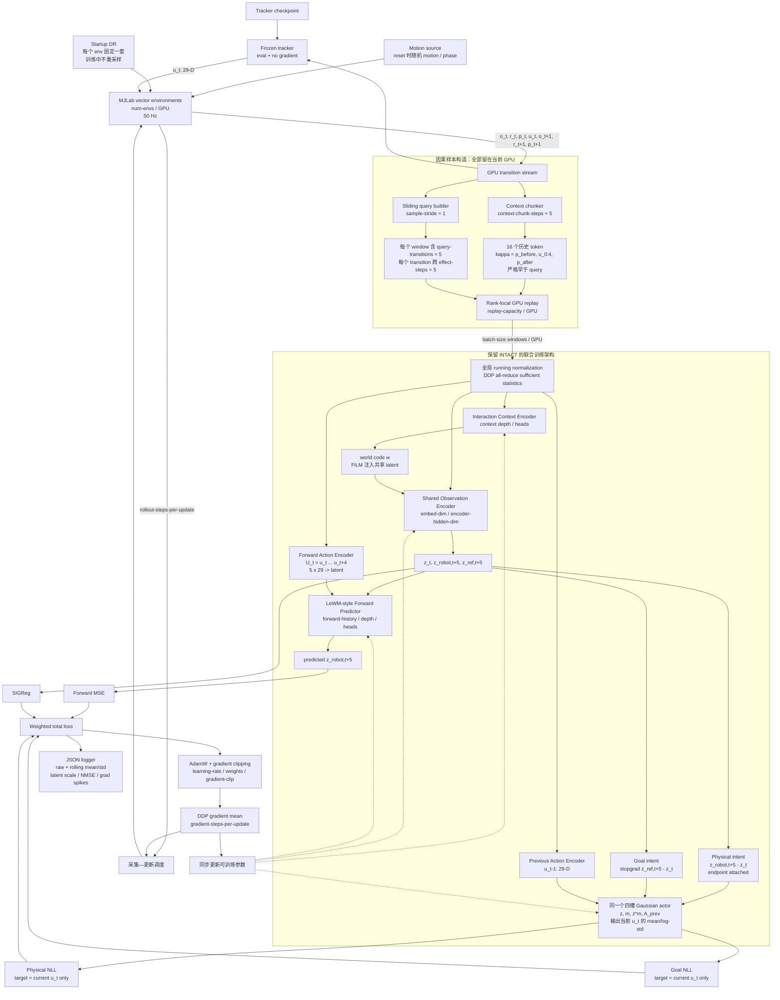

# 纯在线 INTACT 训练流程与参数

当前实现将四个原本容易混淆的时间尺度完全分开：

- `policy_action_steps = 1`：actor 每次只输出当前一步 `u_t ∈ R^29`，这是固定架构语义；
- `effect_steps = 5`：Forward 使用真实执行的 5 步动作预测第 5 步末端 latent；
- `sample_stride = 1`：episode 足够长时，每推进一步就产生一个新的滑动 replay window；
- `context_chunk_steps = 5`：每个 interaction token 汇总 5 步 action-response；token 数固定为 16。

## 框图



## 一个训练 window 的精确定义

令 `E = effect_steps`、`H = query_transitions`。对滑动起点 `s` 和
`k = 0, ..., H-1`，令 `t = s + kE`：

```text
Forward input:   U_t = [u_t, ..., u_t+E-1]
Forward target:  z_robot,t+E
Physical intent: z_robot,t+E - z_t
Goal intent:     stopgrad(z_ref,t+E) - z_t
Actor input prev:u_t-1
Actor target:    u_t                  # 只监督一步 29-D action
```

因此，`effect_steps=5` 并不表示 actor 输出 5 步，也不表示每 5 步才采一个样本。未来
endpoint 确实由完整的 5 步真实 action sequence 共同造成；该序列只进入 Forward。actor 的
physical/goal 两条 NLL 都只拟合这个 transition 起点的当前动作。相邻 window 的起点由
`sample_stride` 决定，默认每步平移一次，所以长期来看每一个 `u_t` 都会成为 actor label。

默认 `E=5, H=5, context_chunk_steps=5, context_tokens=16` 时，空 replay 中第一个完整样本
最早需要：

```text
16 × 5 context steps + 5 × 5 query steps = 105 env steps / world
```

## 参数所在节点

| 节点 | 参数 | 默认值 | 作用 |
|---|---|---:|---|
| Vector rollout | `--num-envs` | 16 / rank | 每张 GPU 的并行环境数，也是稳定期每个 vector step 的最大新增 window 数 |
| Vector rollout | `--seed` | 0 | rank 使用 `seed + rank`；影响 motion、DR 和 replay sampling |
| Tracker | `--stochastic-policy` | false | 是否从 frozen tracker 的 Gaussian policy 采样；默认取 mean |
| Forward endpoint | `--effect-steps` | 5 | 一个 latent transition 跨多少真实控制步；Forward action 输入宽度为 `29 × effect_steps` |
| Query | `--query-transitions` | 5 | 一个 replay window 中串联多少个 effect-span transition；影响 Forward 历史与单 window 监督量 |
| Sliding sampler | `--sample-stride` | 1 | 相邻 window 起点间隔；1 表示每步滑动，增大可降低样本重叠与显存写入 |
| Context token | `--context-chunk-steps` | 5 | 每个 action-response token 覆盖的控制步数 |
| Context memory | `context_tokens` | **固定 16** | 当前实验契约，不暴露 CLI 调节 |
| GPU replay | `--replay-capacity` | 8192 / rank | 每张 GPU 保存的 window 数；不是 transition 数，也不是全局容量 |
| 采集/更新比 | `--rollout-steps-per-update` | 1 | 每组优化前新增多少个 vector step；与 `effect_steps` 无关 |
| 优化吞吐 | `--gradient-steps-per-update` | 1 | 每轮做多少次 optimizer step |
| 优化吞吐 | `--batch-size` | 64 / rank | 每次 optimizer step、每张卡抽取的 replay window 数 |
| Model width | `--embed-dim` | 192 | latent 和 Transformer 宽度 |
| Context model | `--context-depth`, `--context-heads` | 2, 4 | interaction encoder 容量 |
| Forward model | `--forward-history`, `--forward-depth`, `--forward-heads` | 3, 6, 8 | LeWM-style predictor 的历史和容量 |
| Actor | `--actor-hidden-dim`, `--actor-depth` | 1024, 3 | 共享 physical/goal actor 容量；输出始终为 29-D mean/log-std |
| Objective | `--forward-weight`, `--sigreg-weight`, `--physical-weight`, `--goal-weight` | 1, .02, .1, .05 | 四条 loss 对总目标的权重 |
| Stability | `--gradient-clip` | 1.0 | gradient norm 上限；日志中的 norm 是裁剪前值 |
| SIGReg | `--sigreg-projections` | 1024 | 随机投影数；越大估计更稳、计算越重 |
| Optimizer | `--learning-rate`, `--weight-decay` | 5e-4, 1e-3 | AdamW 与 cosine schedule 参数 |
| Logger | `--log-interval`, `--metric-window` | 10, 100 | 终端频率及 rolling mean/std 的 update 窗口 |

`effect_steps × query_transitions` 当前必须能被 `context_chunk_steps` 整除，以便 GPU ring 能
精确剔除所有与 query 重叠的 context chunks。

## 采集量与更新量

忽略 episode reset 导致的无效 window，在 `W` 张 GPU 上：

```text
每轮新增 window ≈ W × num_envs × rollout_steps_per_update / sample_stride
每轮抽样 window  = W × batch_size × gradient_steps_per_update
```

两者的比值中 `W` 会抵消。对于每卡 `num-envs=4096`、`rollout-steps-per-update=1`、
`batch-size=512`、`gradient-steps-per-update=8`、`sample-stride=1`：

```text
新增 = 4096 windows / rank / update
抽样 = 512 × 8 = 4096 windows / rank / update
```

这才是近似 1:1。若把 `rollout-steps-per-update` 设为 5，则每卡约新增 20480 个 window、只
抽 4096 个，单轮只覆盖约 20% 的新增样本。replay 采样是随机的，“1:1”表示期望吞吐匹配，
不保证每个新 window 恰好被抽一次。

## 日志判读

每个 update 记录原始值，并在 `window` 下记录最近 `--metric-window` 轮的均值与标准差：

- `forward_nmse = forward_loss / forward_target_variance`：比裸 latent MSE 更可比较；
- `forward_vs_copy_ratio = forward_loss / forward_copy_mse`：小于 1 才表示 Forward
  优于直接用当前 latent 充当未来 latent；
- `forward_state_cosine_similarity`：预测与真实 endpoint latent 的平均余弦相似度，越接近 1
  越好；
- `forward_action_consistency_mae_env`：预测 endpoint 与真实 endpoint 经同一个 physical
  action actor 解码后，两者在原始环境 action 单位上的 MAE；这是最直接的 Forward
  control-relevant error；
- `forward_decoded_action_mae_env` / `forward_decoded_action_rmse_env`：预测 endpoint 解码出的
  action 相对 rollout action 的端到端误差；
- `physical_action_mae_env` / `goal_action_mae_env`：真实 physical endpoint / reference endpoint
  分支相对 rollout action 的误差，均已反归一化到环境 action 单位；
- `latent_std_mean/min/max` 与 `latent_collapsed_fraction`：检查 representation 缩放或塌缩；
- `weighted_*`：直接显示四项 loss 对 total 的实际贡献；
- `physical_log_std`、`goal_log_std`：区分 MAE 改变和 Gaussian 方差漂移；
- `gradient_norm/max/p95`、`gradient_clip_fraction`：norm 均为裁剪前值，用于识别尖峰；
- `new_samples_generated`、`sampled_windows`、`sampled_to_new_window_ratio`：核对在线数据/更新比。

该版本的 actor 输出头从旧版 145 维 action block 改为 29 维单步 action，并拆成独立的
Forward-action encoder 与 previous-action encoder。因此旧版 5-step action-block checkpoint
不能直接加载到 `single_step_effect_v1`，需要重新开始 Stage-I 训练。
