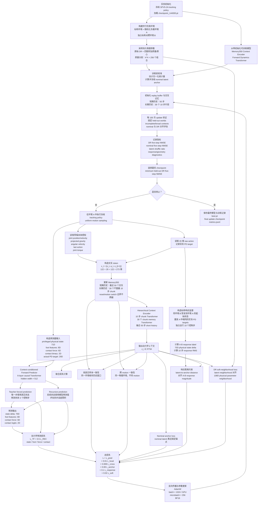
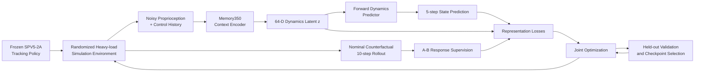

# `144000-exp-heavy` Training Flowchart

本文档总结 `runs/144000-exp-heavy/` 中重载动力学上下文识别实验的训练流程。实验中冻结预训练的 SPV5-2A tracking policy，仅从零训练 Memory350 context encoder 和 forward dynamics predictor。

## Detailed training flowchart

## Compact paper-style flowchart

## Figure caption

> **Training pipeline of the heavy-load context identification experiment.** The pretrained SPV5-2A tracking policy is frozen during training. Interaction histories collected from randomized heavy-load environments are encoded by a hierarchical Memory350 encoder into a 64-dimensional dynamics latent. The latent conditions a forward dynamics predictor trained with teacher-forced and recursive five-step prediction losses. In parallel, an independent nominal simulator replays the same joint targets to obtain a ten-step randomized-to-nominal response signal, which supervises the geometry of the latent space. Local temporal consistency, cross-motion consistency, nominal anchoring, response-distance alignment, and soft physical-neighborhood losses are jointly optimized. Model selection is performed using held-out five-step DR prediction NMSE.

## Main implementation facts

- The tracking policy is frozen; only the context encoder and forward predictor are optimized.
- The encoder input is noisy proprioception and control history, not privileged physical parameters.
- The encoder uses 50 short-history steps and 30 non-overlapping 10-step long-history chunks.
- The context latent has dimension 64.
- The forward predictor forecasts five control steps.
- The randomized-to-nominal response target uses a separate ten-step counterfactual rollout.
- Training uses 8 GPUs, 16,384 worlds per GPU, batch size 1,024 per GPU, microbatch size 256, BF16, and AdamW.
- Validation is performed every 100 updates, and the best checkpoint is selected by held-out DR five-step NMSE.
- In the recorded run, training stopped after 8,816 updates and 35,264 optimizer steps.
